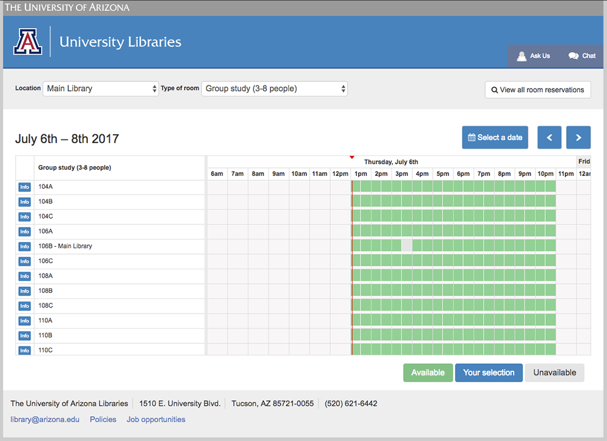

# University of Arizona Libraries LibCal Customizations

[](https://travis-ci.org/ualibraries/ual-libcal)
[](https://standardjs.com)



## Getting started

Install the dependencies: `npm install`

Build the project for production with `npm run build:prod`

Push your changes to the remote, then deploy to production with `npm run deploy:prod`

## Scripts

You can build the project with [Webpack](https://webpack.github.io/) by running
`npm run build:prod` (builds for production) or `npm run build:dev` (builds for development).

Deployment is handled with [Shipit](https://github.com/shipitjs/shipit).
Deploy for production (from the `master` branch) by running `npm run deploy:prod`,
or for development (from the `develop` branch) by running `npm run deploy:dev`.

This project uses [JavaScript Standard Style](https://standardjs.com/).
Test it by running `npm test`.

### Deploying with a specific username

By default, Shipit uses your current OS username for connecting to the remote server.
To override that, use the `--user` parameter. Example: `shipit prod deploy --user=YOUR_USERNAME`

## LibCal settings

In the LibCal dashboard, go to 'Admin' -> 'Look & Feel'.

Paste the following code into 'Code Customizations' field.

```
<script type="text/javascript" src="http://www.library.arizona.edu/vendor-support/libcal/current/dist/bundle.js"></script>
```

## Local testing

Start a local static webserver by running `npm run serve`. You will then be provided
with a script tag which you can paste into the LibCal's 'Code Customizations' field.
The `bundle.js` file will be served from your local disk.

## Learn more

* [PostCSS](http://postcss.org/) and [PostCSS-cssnext](http://cssnext.io/)
* [Babel](https://babeljs.io/)
* [Webpack](https://webpack.js.org/)
* [JavaScript Standard Style](https://standardjs.com/)
* [Shipit](https://github.com/shipitjs/shipit)
* [AVA](https://github.com/avajs/ava)
* [Travis CI](https://travis-ci.org/)
